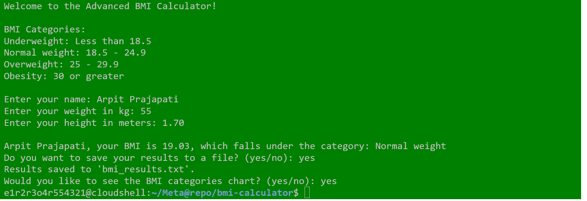

# Advanced BMI Calculator

This project provides an advanced BMI (Body Mass Index) calculator built using Python. It calculates the BMI, categorizes it, and offers additional features such as displaying a BMI chart and saving results to a file.

## Output:



## Features:
- **User Input Validation**: Ensures valid input for weight and height.
- **BMI Calculation**: Calculates BMI using the formula `BMI = weight / height^2`.
- **BMI Category Display**: Categorizes the BMI value (Underweight, Normal weight, Overweight, Obesity).
- **Graphical BMI Visualization**: Displays a chart showing the BMI categories.
- **Save Results**: Allows the user to save their BMI results to a text file.
- **Save Chart Option**: If the GUI is unavailable, the chart can be saved as a `.png` file.

## Requirements:
- Python 3.x
- Matplotlib (for chart plotting)

### Installation:
1. Ensure Python 3.x is installed on your system.
2. Install Matplotlib:
   ```bash
   pip install matplotlib
   ```
3. Clone Repository:
   ```bash
   git clone https://github.com/GET-UNKNOWN-ERR0R/bmi-calculator.git
   cd bmi-calculator
   ```
4. Run:
   ```bash
   python3 bmi-calculator.py
   ```
## License          
